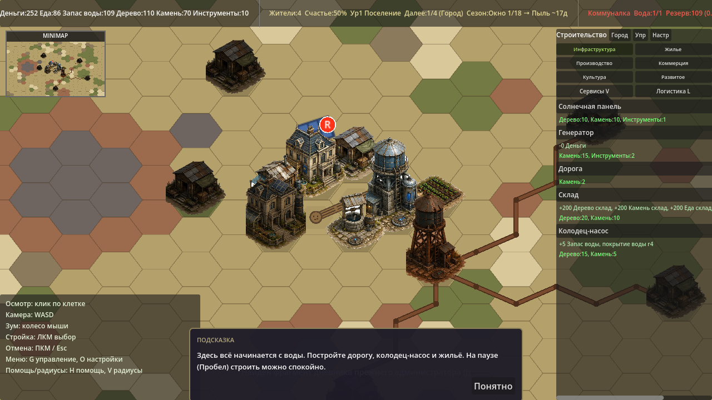
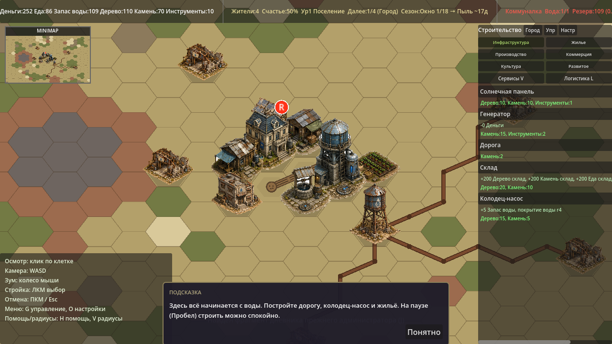
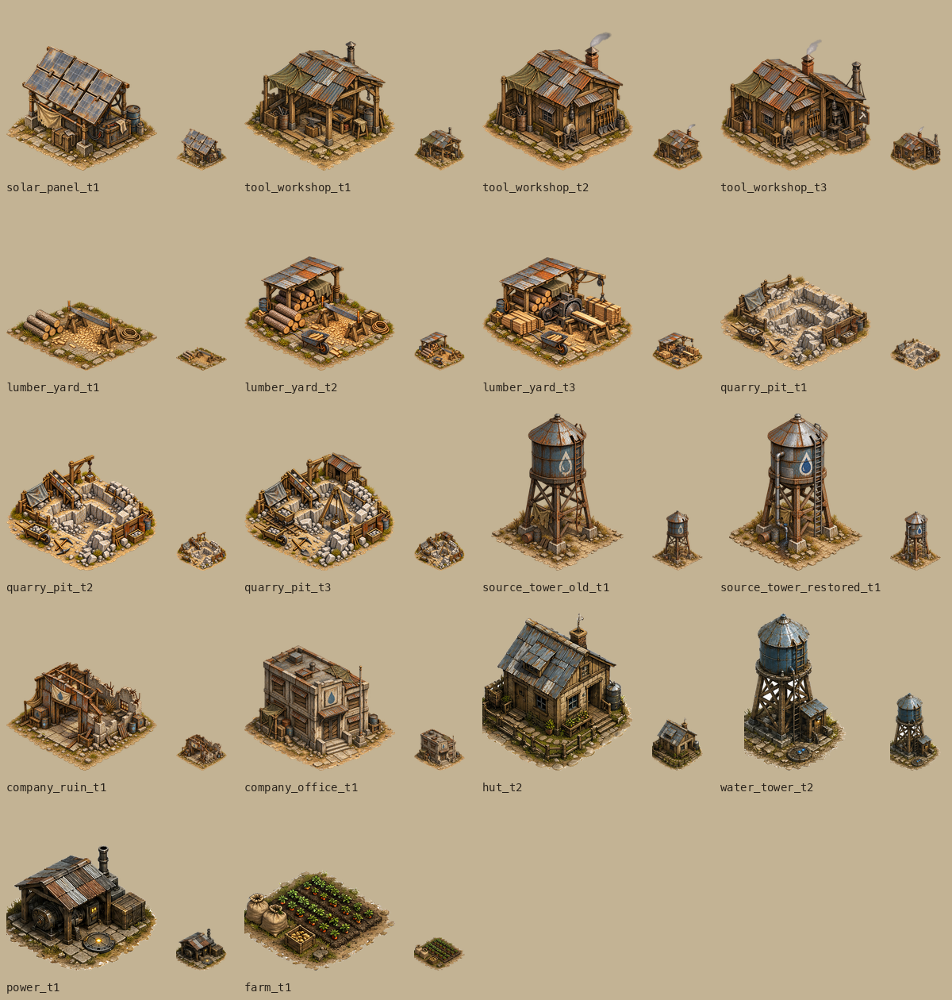

# Visual pass B1: missing building sprites

Выполнен только этап P1 из [ART_TASK_CODEX.md](ART_TASK_CODEX.md).
В таблице задания фактически **14 файлов для 8 типов зданий**, несмотря на
«13 файлов» в заголовке. Подключены все 14; игровые параметры и GDScript не менялись.

## Файлы и подключение

Все новые спрайты находятся в `godot/assets/buildings/tiers/`:

| Тип | PNG |
|---|---|
| `bld_solar_panel` | `solar_panel_t1.png` |
| `bld_tool_workshop` | `tool_workshop_t1.png`, `tool_workshop_t2.png`, `tool_workshop_t3.png` |
| `bld_lumber_yard` | `lumber_yard_t1.png`, `lumber_yard_t2.png`, `lumber_yard_t3.png` |
| `bld_quarry_pit` | `quarry_pit_t1.png`, `quarry_pit_t2.png`, `quarry_pit_t3.png` |
| `bld_source_tower` | `source_tower_old_t1.png` |
| `bld_source_tower_restored` | `source_tower_restored_t1.png` |
| `bld_company_ruin` | `company_ruin_t1.png` |
| `bld_company_office` | `company_office_t1.png` |

В `buildings.json` заменены только восемь массивов `sprites_by_level` и удалены
три старые тонировки `sprite_tint` у башни, руин и офиса.

## Генерация и исправления

Использован встроенный инструмент GPT Image (`image_gen`), без отдельного API-ключа.
Идентификатор модели и API-параметры инструмент не раскрывает, поэтому конкретный
`gpt-image-1` не подтверждён. В запросах указаны high-quality, PNG RGBA, 1024×1024
и прозрачность. Фактические выбранные результаты были 1254×1254, затем подготовлены
к требуемому игровому формату 1024×1024.

Во всех запросах приложены четыре обязательных стилевых референса:
`hut_t2`, `water_tower_t2`, `power_t1`, `farm_t1`.
Для t2/t3 пятым изображением передавался предыдущий принятый уровень, для
восстановленной башни — старая башня. Повторные правки также использовали текущий
вариант как пятое изображение. Полные текстовые запросы и связи уровней сохранены
в [ART_PASS_B1_PROMPTS.json](ART_PASS_B1_PROMPTS.json).

Не все запросы сработали с первого раза:

- `tool_workshop_t2`: появился горящий фонарь. Точечный запрос «change only the
  lantern … extinguished, dark grey glass» убрал огонь, сохранив здание.
  В t3 это ограничение повторено явно. Один ранний запрос t2 был прерван до выдачи результата.
- `lumber_yard_t1`: генератор преждевременно добавил навес. Правка «REMOVE THE
  ENTIRE SHED … LOW HORIZONTAL silhouette» оставила открытую площадку с козлами,
  пилой, брёвнами и верёвкой. Навес добавлен только в t2.
- `lumber_yard_t2`, `quarry_pit_t2`: появились непрозрачный фон и коричневая дымка.
  Отдельная правка background extraction с явным `alpha=0 outside sprite`
  дала прозрачный силуэт без ореола.
- `company_ruin_t1`: грунт касался правого края. Правка кадрирования «ZOOM OUT
  by 25 percent … COMPLETE diamond ground skirt» вернула целое основание.

При подготовке файлов убраны почти невидимые пиксели с alpha ≤ 13/255
(порог силуэта соответствует рендереру Godot) и единичные изолированные пиксели.
Основной силуэт масштабирован равномерно, без растяжения, до ширины около 800 px
и высоты не более 926 px, затем помещён на прозрачный холст 1024×1024.
Нижняя граница всех силуэтов — y=942; у высоких башен ширина 783–785 px.
После уменьшения удалены изолированные пиксели ресэмплинга. Рисунок, ракурс,
цвета и геометрия при этой технической подготовке не перерисовывались.

## Проверка

Godot **4.6.1 stable**, macOS, Compatibility renderer. Перед первым запуском
создан локальный кэш импорта (`--headless --editor --import`): без него чистая
копия проекта не находила зарегистрированные классы. После импорта ошибок нет.

```bash
python3 godot/tools/validate_art_p1.py  # требуется Pillow
Godot --headless --editor --path godot --import
Godot --headless --path godot --quit-after 240
Godot --headless --path godot res://tools/balance_sim.tscn
Godot --headless --path godot res://tools/save_roundtrip.tscn
Godot --path godot --resolution 1280x720 res://tools/screenshot.tscn -- out=/abs/existing/dir
```

- `P1 ART: 14/14 sprites checked, 0 errors`: PNG RGBA 1024×1024, нулевая альфа
  на всех краях, ровно один 8-связный блок всех пикселей с ненулевой альфой,
  нижняя граница в нижних 15% холста; пути и отсутствие тонировок проверены.
- Импорт и headless-запуск: нет `SCRIPT ERROR`, `Parse Error`, `Failed to load`.
- Полный вывод `balance_sim` до и после **побайтово совпал**, включая A–F.
- `save_roundtrip`: `validation errors: []`, `ROUND-TRIP: 0 differing fields`.
- Карта просмотрена в игровом рендерере; отдельная таблица показывает все уровни
  рядом с четырьмя референсами, включая уменьшенные до 64 px силуэты.

## Скриншоты

Обе карты сняты штатным `screenshot.tscn` при 1280×720. Этот инструмент создаёт
новую игру со случайным seed: расположение стартовых зданий и камера совпадают,
но рисунок земли между запусками отличается. Изменения земли в P1 не вносились.

До:



После:



Все новые спрайты и референсы; маленькие версии имеют ширину силуэта 64 px:


