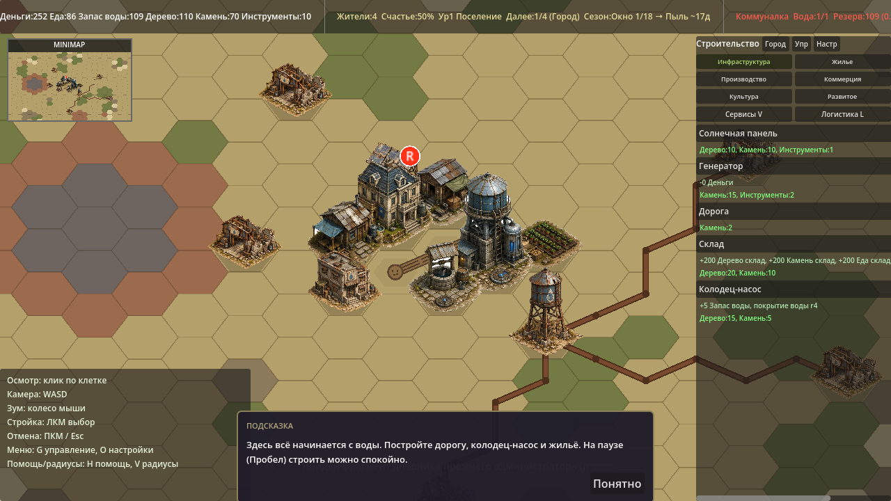
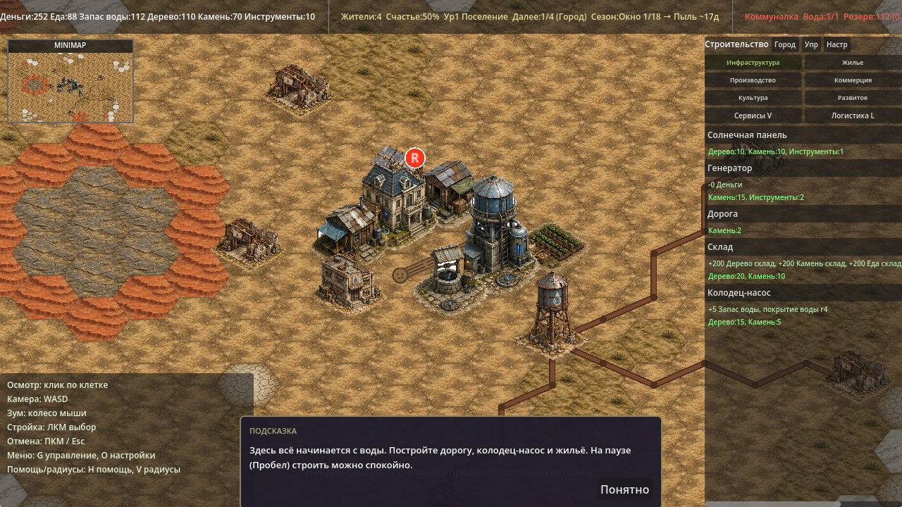
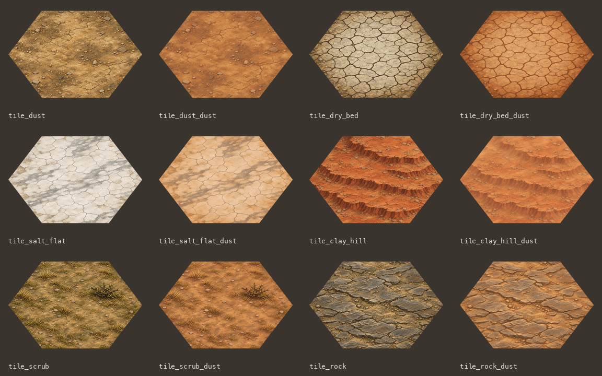

# Visual pass B2: terrain tiles

Этап P2 из [ART_TASK_CODEX.md](ART_TASK_CODEX.md), поверх влитого P1.
Шесть типов земли получили обычную и пыльную текстуры. В `terrain.json` добавлены
только поля `tile`/`tile_dust`; идентификаторы, доступность строительства и цены прежние.

## Ассеты

Все 12 файлов находятся в `godot/assets/tiles/`:

| Тип | Окно | Пыль |
|---|---|---|
| 0 — пыльная земля | `tile_dust.png` | `tile_dust_dust.png` |
| 1 — сухое русло | `tile_dry_bed.png` | `tile_dry_bed_dust.png` |
| 2 — солончак | `tile_salt_flat.png` | `tile_salt_flat_dust.png` |
| 3 — глинистый холм | `tile_clay_hill.png` | `tile_clay_hill_dust.png` |
| 4 — сухой кустарник | `tile_scrub.png` | `tile_scrub_dust.png` |
| 5 — скальник | `tile_rock.png` | `tile_rock_dust.png` |

PNG RGBA 256×192. Маска повторяет вершины `HexCoords`: центр (128,96),
`x=128+128*cos(angle)`, `y=96+96*sin(angle)`, шаг угла 60°.
Гекс занимает всю ширину, его геометрическая высота — `192*sqrt(3)/2 ≈ 166.3 px`;
сглаженная альфа имеет bbox `(0,12,256,180)`. Углы прозрачны. Это согласуется
с прямоугольником отрисовки 64×48 и существующим сжатием Y=0.75.

Использован встроенный GPT Image (`image_gen`); точный идентификатор модели
инструмент не раскрывает, поэтому именно `gpt-image-1` не подтверждён.
Каждый запрос содержал четыре обязательных референса `hut_t2`, `water_tower_t2`,
`power_t1`, `farm_t1` как образцы палитры и стиля. Каждый вариант Пыли — правка
своего обычного тайла, переданного пятым изображением. Полный набор запросов:
[ART_PASS_B2_PROMPTS.json](ART_PASS_B2_PROMPTS.json).

Все 12 генераций приняты с первого запроса; дополнительных художественных
перегенераций не было. Уточнения в промптах исключали здания из референсов,
объёмную боковину тайла, обводку и дымку за пределами гекса.
Крупные исходники уменьшены до игрового размера и выровнены общей маской.
Для неровных рисованных краёв оставлен запас текстуры под маской около 10%:
вариант с 8% оставлял один недостаточно непрозрачный пиксель у края холма.
После увеличения запаса все пиксели под маской покрыты исходной текстурой.
Цвета и рисунок поверхностей программно не перерисовывались.

## Рендер

`hex_terrain_layer.gd` рисует текстуру в требуемом прямоугольнике 64×48,
оставляет тонкую сетку и трубы поверх земли. При `season_dust` выбирается
`tile_dust`, в остальных сезонах — `tile`. Сигнал `EventBus.season_changed`
вызывает `queue_redraw()`.

Кэш привязан к пути ресурса. Отсутствующие ресурсы также запоминаются как `null`,
чтобы не проверять их заново для каждой клетки. Если поле отсутствует, пусто
или файл недоступен, клетка рисуется старым цветным полигоном; это относится
и к отсутствующему сезонному варианту. Неизвестный тип сохраняет серый fallback.

## Проверки

Godot 4.6.1 stable, macOS, Compatibility renderer. Выполнены:

```bash
Godot --headless --path godot --editor --quit
Godot --headless --path godot --editor --import
python3 godot/tools/validate_art_p2.py  # Pillow в venv
Godot --headless --path godot --quit-after 240
Godot --headless --path godot res://tools/balance_sim.tscn
Godot --headless --path godot res://tools/save_roundtrip.tscn
Godot --path godot res://tools/terrain_smoke.tscn
Godot --path godot --resolution 1280x720 res://tools/screenshot.tscn -- out=/abs/existing/dir seed=12345 capture_dust
```

- `P2 ART: 12/12 tiles checked, 0 errors`: формат, пути, прозрачные углы,
  заполнение гекса без дыр, одинаковая маска всех вариантов, различие сезонов.
- Импорт/headless/сцены: нет ошибок скриптов, парсинга и загрузки.
- Полный вывод `balance_sim` A–F побайтово совпал с базой до P2.
- `save_roundtrip`: `validation errors: []`, `ROUND-TRIP: 0 differing fields`.
- `TERRAIN SMOKE: 0 failures`: реальные пиксели изменяются по сигналу сезона
  и точно восстанавливаются при возврате в Окно; отсутствие поля или файла
  даёт прежний цвет. Проверены загрузка 12 текстур, повторное использование
  кэша и неизвестный тип земли. Этот тест требует графический рендерер.
- Визуально проверены карта в обоих сезонах, стыки гексов и обзор всех 12 тайлов.

В штатный инструмент скриншотов добавлены необязательные `seed=12345` и
`capture_dust`; без аргументов прежнее поведение сохранено. Пыльный снимок —
визуальный тест через состояние климата и настоящий сигнал, а не ожидание
18 игровых дней. Снимки до/после используют одинаковый seed и камеру;
счётчики ресурсов могут отличаться из-за времени отрисовки кадров.

## Скриншоты

До P2:



После, Окно:



После, Пыль:


Все тайлы, в каждой паре слева Окно, справа Пыль:


