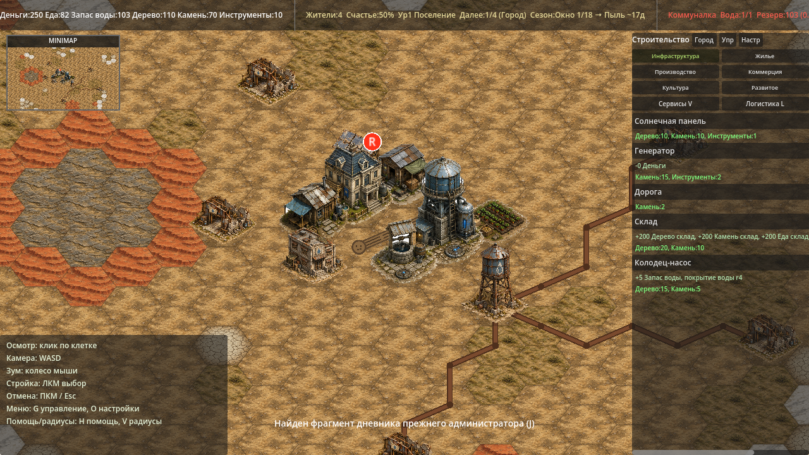
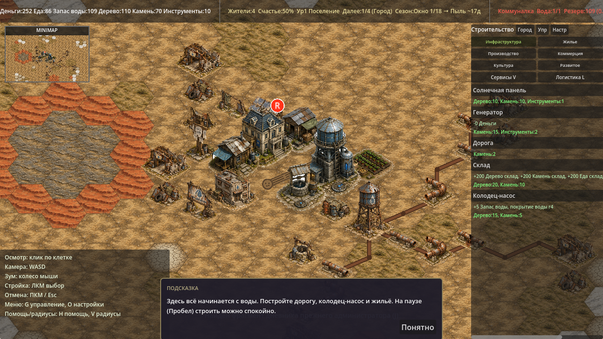
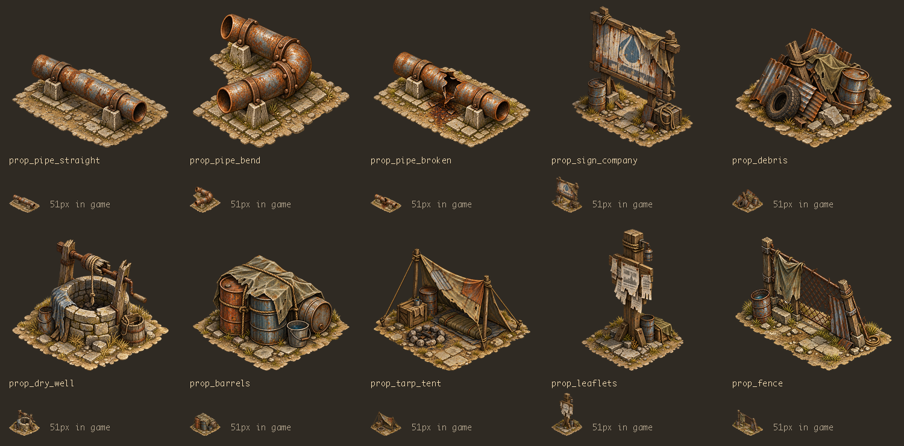

# Visual pass B3: props

Этап P3 из [ART_TASK_CODEX.md](ART_TASK_CODEX.md), поверх влитого P2.
Десять видов реквизита заполняют район следами Компании и бытовыми деталями.

## Ассеты

Все файлы — PNG RGBA 512×512 в `godot/assets/props/`:

- `prop_pipe_straight.png` — прямая труба на бетонных опорах;
- `prop_pipe_bend.png` — угловая труба с фланцами;
- `prop_pipe_broken.png` — разорванная труба и ржавый след;
- `prop_sign_company.png` — щит с выцветшей каплей;
- `prop_debris.png` — железо, шина, бочка;
- `prop_dry_well.png` — сухой колодец со сломанным воротом;
- `prop_barrels.png` — бочки под брезентом и ведро;
- `prop_tarp_tent.png` — навес, ящик, костровое кольцо, спальник;
- `prop_leaflets.png` — столб с листовками;
- `prop_fence.png` — покосившаяся сетчатая ограда.

Использован встроенный GPT Image (`image_gen`). Точный идентификатор модели
инструмент не раскрывает. Все запросы включали четыре обязательных референса
`hut_t2`, `water_tower_t2`, `power_t1`, `farm_t1`. Угловая и сломанная трубы —
правки прямой трубы, переданной пятым изображением.
Полные запросы: [ART_PASS_B3_PROMPTS.json](ART_PASS_B3_PROMPTS.json).

Первый результат для `prop_pipe_bend` остался прямым. Повторная правка явно
задала два коротких колена с изменением направления, большой угловой стык
и запрет на прямую ось. Остальные предметы приняты с первого запроса.

Техническая подготовка через Pillow: обрезка пустого холста, равномерное
уменьшение, размещение на холсте 512×512 с нижней границей силуэта на y=471.
Ширина силуэта — до 400 px, высота — до 440 px; пропорции сохранены.
Альфа ниже 13/255 и отдельные краевые пиксели удалены, оставлен крупнейший
8-связный компонент. Рисунок, палитра и материалы программно не рисовались.

## Подключение

`_bootstrap_company_traces` добавляет фиксированный массив `{q, r, id}`
в `world.decor.props`, не расходуя RNG. Девять секций труб стоят вдоль трёх
существующих трасс; щит — у конторы, бочки — у цистерны, листовки — у барака.
Хлам появляется возле фактически поставленных руин. Декор не меняет землю,
экономику, доступность клеток или пространственный индекс зданий.

`hex_terrain_layer.gd` рисует декор после земли и старых линий труб, до слоя
зданий. Пропсы сортируются по экранному Y. Текстуры обрезаются по альфе и
кэшируются, ширина — `HEX_SIZE * 1.6` (51.2 px); якорь — центр ромба,
как у зданий. Отсутствующие текстуры пропускаются и кэшируются как `null`.

После успешной `PlaceBuildingCommand` все пропсы на занятой клетке удаляются.
Отказ в строительстве сохраняет их. Сигнал размещения вызывает перерисовку
земли сразу; снос не восстанавливает декор. Существующий JSON save/load
сохраняет массив и удалённые элементы без изменения версии схемы.
Старые сохранения без `decor` или `props` работают с пустым набором декора;
автоматического заселения уже начатых городов нет.

## Проверки

Godot 4.6.1 stable, macOS, Compatibility renderer:

```bash
Godot --headless --path godot --editor --quit
Godot --headless --path godot --editor --import
python3 godot/tools/validate_art_p3.py  # Pillow в venv
Godot --headless --path godot --quit-after 240
Godot --headless --path godot res://tools/balance_sim.tscn
Godot --headless --path godot res://tools/save_roundtrip.tscn
Godot --path godot res://tools/props_smoke.tscn
Godot --path godot res://tools/terrain_smoke.tscn
Godot --path godot --resolution 1280x720 res://tools/screenshot.tscn -- out=/abs/existing/dir seed=12345
```

- `P3 ART: 10/10 props checked, 0 errors`: формат, размеры, прозрачные края,
  положение силуэта, единый связный блок альфы, полный набор файлов.
- Импорт и headless-запуск без `SCRIPT ERROR`, `Parse Error`, `Failed to load`.
- Полный вывод `balance_sim` A–F побайтово совпал с базой до P3.
- `save_roundtrip`: `validation errors: []`, `ROUND-TRIP: 0 differing fields`.
- `PROPS SMOKE: 0 failures`: фиксированная раскладка, отсутствие расхода RNG,
  все десять типов, JSON save/load, кэш, пропуск отсутствующего спрайта,
  строительство поверх декора, сохранение при отказе, удаление всех пропсов
  только на нужной клетке, реальная перерисовка без оставшихся пикселей,
  отсутствие восстановления после сноса/загрузки, совместимость старых миров.
- `TERRAIN SMOKE: 0 failures`: регрессия сезонных текстур и цветного fallback.
- Визуально проверены карта и обзор всех пропсов с миниатюрами шириной 51 px.

Оба smoke-теста требуют графический рендерер. Проверка сохранения в P3-тесте
сравнивает нормализованные JSON-значения: после JSON числа становятся float.

## Скриншоты

Одинаковые seed=12345 и камера; счётчики ресурсов могут отличаться из-за
времени отрисовки кадров.

До P3:



После P3:



Все десять пропсов, включая отображение с шириной 51 px:


