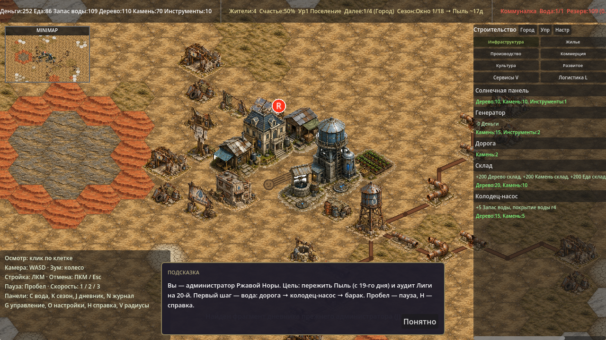
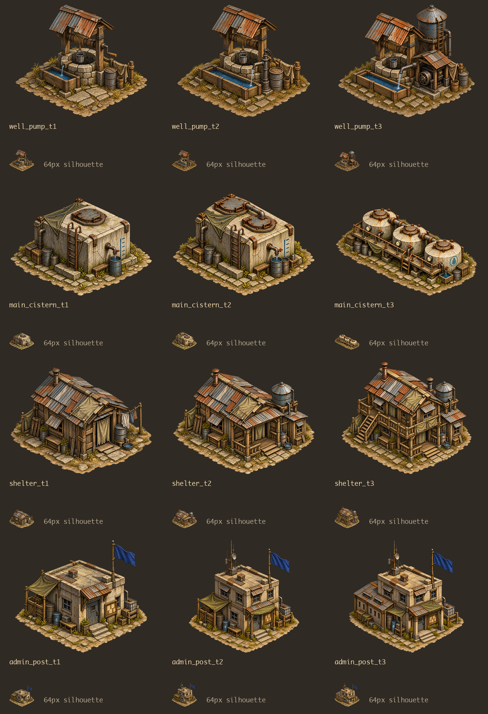

# Visual pass B4: replace shared sprites

P4 из [ART_TASK_CODEX.md](ART_TASK_CODEX.md): четыре здания получили собственные
три уровня графики. Колодец, цистерна, барак и пост администрации теперь имеют
разные силуэты. Все изменения поверх P3 и обновлённого онбординга (`3d76b16`).

## Ассеты и подключение

12 PNG RGBA 1024×1024 в `godot/assets/buildings/tiers/`:

| Здание | Первый уровень | Второй уровень | Третий уровень |
|---|---|---|---|
| Колодец-насос | `well_pump_t1.png`: каменный колодец с воротом, ведром и корытом | `well_pump_t2.png`: чугунная колонка, длинное корыто, бочка | `well_pump_t3.png`: моторный насос под крышей, небольшой бак, труба |
| Главная Цистерна | `main_cistern_t1.png`: низкий бетонный резервуар с люком, краном и отметками уровня | `main_cistern_t2.png`: два соединённых бака и разлив | `main_cistern_t3.png`: три бака на низкой опоре, мостки, приборы, капля |
| Жилой барак | `shelter_t1.png`: дощатый барак с дверью-занавеской и бельём | `shelter_t2.png`: пристройка, бак на крыше, крыльцо | `shelter_t3.png`: второй этаж, галерея, лестница, две трубы |
| Пост администрации | `admin_post_t1.png`: бетонный блок с синим флагом и доской | `admin_post_t2.png`: второй этаж, антенна, крытый вход | `admin_post_t3.png`: архивное крыло и увеличенная доска |

В `buildings.json` заменены только четыре массива `sprites_by_level`.
Проверка JSON до/после подтверждает, что остальные поля идентичны.
Старые общие спрайты оставлены для других потребителей. Рендер использует
существующие обрезку по силуэту, ромбовый якорь и сортировку зданий по Y.

## Генерация

Использован встроенный GPT Image (`image_gen`); точный ID модели инструмент
не раскрывает. Все запросы включали обязательные `hut_t2`, `water_tower_t2`,
`power_t1`, `farm_t1` как образцы стиля и палитры. Для каждого здания t1
создавался отдельно; t2 — правкой t1, t3 — правкой t2, с предыдущим исходником
пятым изображением. Полные запросы: [ART_PASS_B4_PROMPTS.json](ART_PASS_B4_PROMPTS.json).

Первый t3 цистерны получился слишком высоким: генератор поставил три
маленьких бака поверх бетонного блока. Для повторной правки явно заданы три
широких бетонных резервуара рядом на низкой опоре и запрещены баки на крыше.
Остальные 11 спрайтов приняты с первого запроса.

Техническая подготовка: Pillow, удаление пустого холста, равномерное уменьшение,
прозрачный холст 1024×1024, нижняя граница силуэта y=942. Максимальная ширина
800 px, высота 880 px; пропорции сохранены. Оставлен основной 8-связный
компонент альфы с порогом 13/255. Рисунок и цвета программно не перерисовывались.

## Проверка

Godot 4.6.1 stable, macOS, Compatibility renderer:

```bash
Godot --headless --path godot --editor --quit
Godot --headless --path godot --editor --import
python3 godot/tools/validate_art_p4.py  # Pillow в venv
Godot --headless --path godot --quit-after 240
Godot --headless --path godot res://tools/balance_sim.tscn
Godot --headless --path godot res://tools/save_roundtrip.tscn
Godot --path godot --resolution 1280x720 res://tools/screenshot.tscn -- out=/abs/existing/dir seed=12345
```

- `P4 ART: 12/12 sprites checked, 0 errors`: формат, размеры, прозрачные края,
  один связный силуэт, положение внизу холста, правильные пути, три разных
  изображения для каждого здания, отсутствие лишней тонировки.
- Импорт/headless/скриншот без `SCRIPT ERROR`, `Parse Error`, `Failed to load`.
- Полный вывод `balance_sim` A–F побайтово совпал с базой до P4.
- `save_roundtrip`: `validation errors: []`, `ROUND-TRIP: 0 differing fields`.
- Временная визуальная сцена вызвала штатные `_get_building_sprite` и
  `_draw_building_sprite` для всех 12 сочетаний типа и уровня:
  `P4 RENDER: 12 mapped sprites, 0 failures`. Проверены обрезка, якоря и
  отображение всех улучшений реальным рендерером Godot.
- Визуально проверены карта, все уровни рядом и миниатюры шириной 64 px.

Геймплейные поля и код рендера не менялись.

## Скриншоты

Одинаковые seed=12345 и камера; игровые счётчики и временные подсказки зависят
от времени отрисовки кадров.

До:



После:


Все уровни: в каждой строке t1 → t2 → t3, крупный вид и силуэт шириной 64 px.


