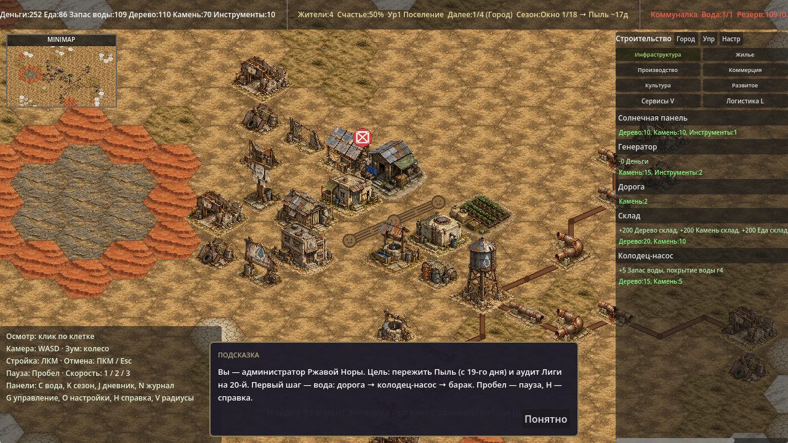
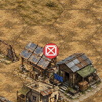
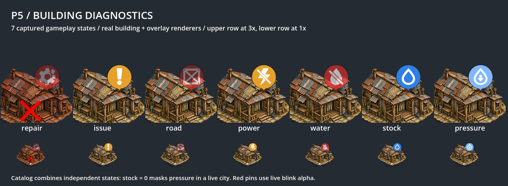
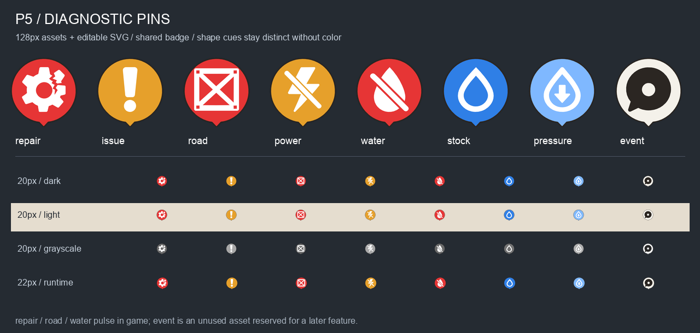

# Visual pass B5: diagnostic pins

P5 из [ART_TASK_CODEX_P5_PINS.md](ART_TASK_CODEX_P5_PINS.md), база `main@9a5cd59`.
Вместо букв над зданиями отображаются плоские пиктограммы главной причины проблемы.

## Ассеты и рендер

В `godot/assets/ui/pins/` добавлены восемь PNG RGBA 128×128:
`pin_repair`, `pin_issue`, `pin_road`, `pin_power`, `pin_water`, `pin_stock`,
`pin_pressure`, `pin_event`. В `src/` лежат соответствующие SVG с настоящими
векторными контурами, без встроенных растров. `event` оставлен только как ассет.

`overlay_layer.gd` загружает текстуры по `diag.label`, кэширует и текстуры,
и отсутствующие файлы (`null`). Размер отрисовки 22×22, прежнее смещение
`(14, -28)`, низ бейджа — `center + (0, 11)`. Если файла нет, остаётся старый
кружок с буквой. Выбор и приоритет диагностик не изменены.

Красные `repair`, `road`, `water` используют альфу
`0.55 + 0.45 * abs(sin(Time.get_ticks_msec() / 400.0))`.
Флаг мигания сбрасывается при каждом проходе отрисовки; после исчезновения
красных пинов непрерывная перерисовка прекращается. Существующие перерисовки
режимов строительства, радиусов и логистики сохранены.

Для настоящего спрайта здания убран дублирующий жёлтый `!`.
Красный крест повреждения, точки уровня и предупреждение у полигонального
fallback остались. Данные баланса, сохранений и интерфейс P6 не менялись.

## Генерация и исходники

Использован встроенный `image_gen` (точный ID модели инструмент не раскрывает).
Первый принятый `repair` приложен к каждому из остальных семи запросов как
образец бейджа. Референсы изометрических зданий не использовались.
Полные запросы и пути исходных изображений:
[ART_PASS_B5_PROMPTS.json](ART_PASS_B5_PROMPTS.json).

У первых `stock` и `pressure` контур капли был слишком тонким для 20 px.
Повторные правки утолщили контур; у `pressure` также уменьшена стрелка,
чтобы сохранить просвет. Итого восемь первичных запросов и две правки.

Техническая подготовка: трассировка контуров OpenCV с допуском 1.4 пикселя
исходника; единый внешний силуэт из альфы `repair`, обводка 2 px, точные
плоские семантические цвета из задания. Пиктограммы центрированы, их длинная
сторона 82 px. У `event` выделен центральный компонент, без внешней рамки.
SVG экспортированы средствами Godot при 4× и уменьшены Lanczos до 128×128.
Хвост касается нижнего края. PNG можно воспроизвести из включённых SVG:

```bash
Godot --headless --path godot --script res://tools/export_pins.gd
```

## Проверки

Godot 4.6.1 stable, macOS, Compatibility renderer:

```bash
Godot --headless --path godot --editor --quit
Godot --headless --path godot --editor --import
python3 godot/tools/validate_art_p5.py  # требуется Pillow
Godot --headless --path godot --quit-after 240
Godot --headless --path godot res://tools/balance_sim.tscn
Godot --headless --path godot res://tools/save_roundtrip.tscn
Godot --path godot --resolution 1280x720 res://tools/screenshot.tscn -- out=/abs/existing/dir seed=12345
Godot --path godot --resolution 1280x720 res://tools/pins_smoke.tscn -- out=/abs/existing/dir
```

- `P5 ART: 8/8 pins checked, 0 errors`: PNG, размеры, альфа, палитра,
  нижний край хвоста, общий силуэт, векторные SVG и различие форм при 20 px.
- Импорт, 240 кадров загрузки и реальные скриншоты без `SCRIPT ERROR`,
  `Parse Error`, `Failed to load`.
- Полный вывод `balance_sim` A–F побайтово совпал с выводом базы до изменений.
- `save_roundtrip`: `validation errors: []`, `ROUND-TRIP: 0 differing fields`.
- `PINS SMOKE: 0 failures`: реальные состояния выбирают все семь диагностик;
  проверены кэш, отсутствующая текстура, буквенный fallback в отрисованных
  пикселях, мигание между кадрами, остановка перерисовки для предупреждения
  и пустого мира, сохранение перерисовки логистики, отсутствие дублирующего
  `!`, сохранение креста повреждения и точек уровня.
- Визуально проверены карта, кроп 200×200, каталог состояний и ряд 20 px
  на светлом/тёмном фоне и в оттенках серого.

Каталог объединяет **отдельно воспроизведённые и проверенные состояния**:
при глобальном запасе воды 0 диагностика `stock` скрывает `pressure` у всех
потребителей. После вычисления штатной `_primary_diagnostic` результат
фиксируется для каждой карточки, отрисовка вызывает штатные методы здания
и пина. Это проверочный каталог, а не снимок одного согласованного города.
Симуляция и автосохранение в проверочной сцене отключены.

## Скриншоты

Одинаковые seed=12345 и камера. Стартовый пин R над солнечной панелью означает
отсутствие дороги; после P5 он заменён ящиком с крестом.

До:


После:



Кроп 200×200 вокруг пина, без увеличения исходных пикселей:



Все семь рабочих состояний, крупный вид и игровой размер:



Все восемь ассетов и миниатюры 20/22 px:


