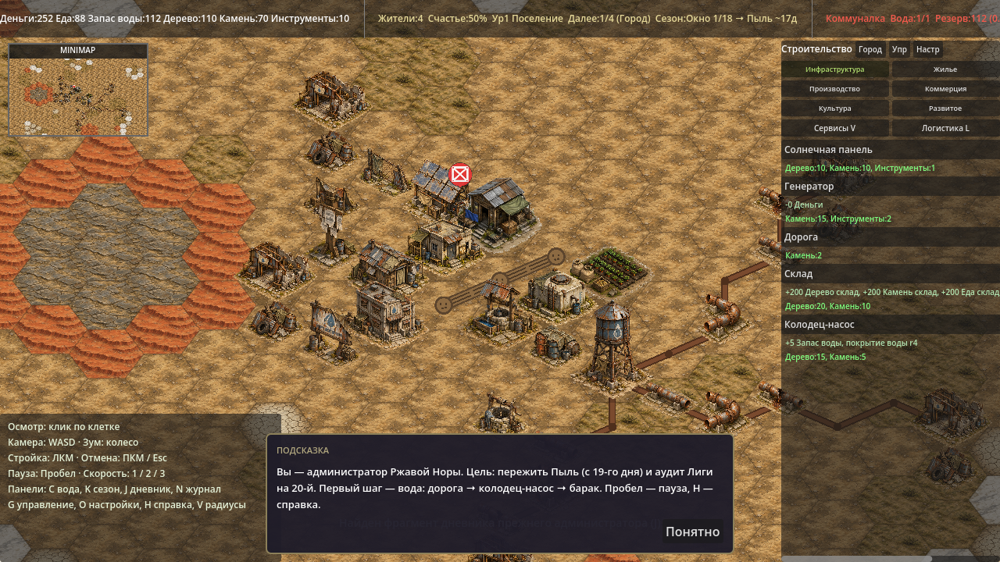
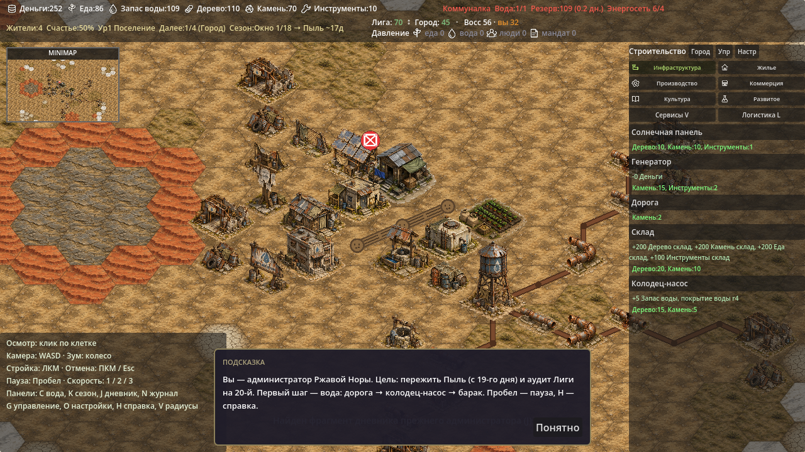
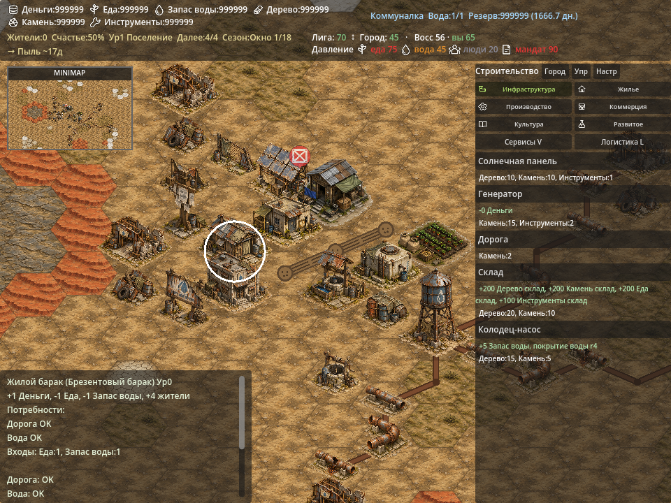
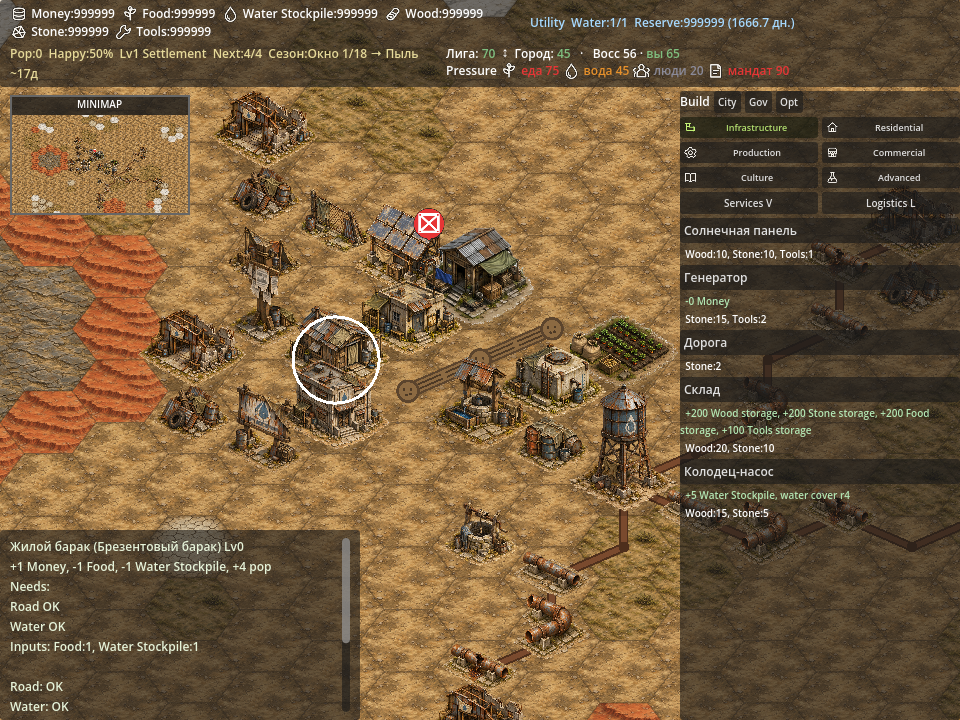
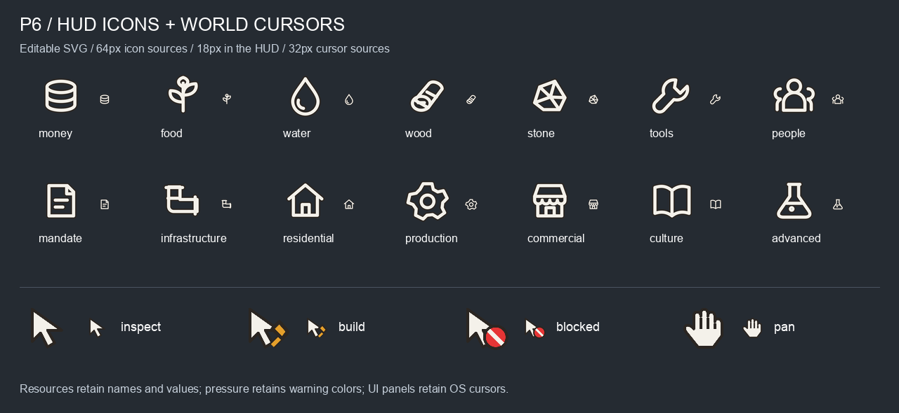

# Visual pass B6: HUD icons and world cursors

Продолжение P5 от `main@b53cfa0`. Объём взят из §7
[ART_TASK_CODEX_P5_PINS.md](ART_TASK_CODEX_P5_PINS.md): ресурсы, давление,
категории строительства и курсоры режимов. Отдельного детального ТЗ P6
на этой базе ещё нет.

## Изменения

14 SVG 64×64 в `godot/assets/ui/icons/`:

| Область | Ассеты |
|---|---|
| Шесть ресурсов | money, food, water, wood, stone, tools |
| Четыре вида давления | food, water (повторно), people, mandate |
| Шесть категорий строительства | infrastructure, residential, production, commercial, culture, advanced |

Иконки нарисованы непосредственно в SVG: простые контуры, тёплый белый
`#f4f1ea`, тёмная обводка `#2b2622`, прозрачный фон. Продолжают плоский
язык UI из P5. Генератор изображений не использовался; исходники в репозитории
редактируемые и не требуют внешних растров или промптов.

`ui_icons.gd` содержит соответствия идентификаторов и общий кэш текстур,
включая отсутствующие файлы. В HUD используются иконки 18 px с сохранением
локализованных названий, значений и цветов предупреждений. При отсутствии
иконки остаётся текст. Неразрывный пробел удерживает пиктограмму возле подписи.

Прежняя единственная строка HUD выходила за правый край экрана и скрывала
показатели давления. Теперь четыре блока размещены в двух строках с переносом
текста. Меню строительства и миникарта следуют за фактической высотой панели.
Сохранены клики по воде/сезону и переключение категорий.
Названия, эффекты и стоимость зданий переносятся внутри меню; длинные строки
больше не растягивают его содержимое и не требуют горизонтальной прокрутки.

Четыре SVG 32×32 в `godot/assets/ui/cursors/`:

| Курсор | Когда | Активная точка |
|---|---|---|
| inspect | осмотр карты | (3, 3) |
| build | выбранное здание можно поставить | (3, 3) |
| blocked | размещение запрещено | (3, 3) |
| pan | перетаскивание камеры средней кнопкой | (16, 16) |

Доступность строительства берётся из существующего `PlacementRules.validate`,
как у превью и команды. Курсор устанавливается только при смене состояния;
над UI, включая автозагружаемые панели воды/сезона/журнала, восстанавливается
системный. Отсутствующий файл также оставляет системный курсор.
Та же проверка попадания в UI используется для кликов: открытые панели воды,
сезона, журнала и подсказки блокируют выбор клетки и строительство под собой.
Новых режимов ремонта или сноса нет: R/B по-прежнему выполняют существующие
действия над выбранным зданием. Пины P5, баланс и формат сохранений не менялись.

## Проверка

Godot 4.6.1 stable, macOS, Compatibility renderer:

```bash
Godot --headless --path godot --editor --quit
Godot --headless --path godot --quit-after 240
Godot --headless --path godot res://tools/balance_sim.tscn
Godot --headless --path godot res://tools/save_roundtrip.tscn
Godot --path godot --resolution 1280x720 res://tools/screenshot.tscn -- out=/abs/existing/dir seed=12345
Godot --path godot --resolution 1280x720 res://tools/ui_icons_smoke.tscn -- out=/abs/existing/dir
```

- Импорт, boot 240 кадров и скриншоты без `SCRIPT ERROR`, `Parse Error`, `Failed to load`.
- Полный вывод `balance_sim` A–F побайтово совпадает с базой до P6.
- `save_roundtrip`: `validation errors: []`, `ROUND-TRIP: 0 differing fields`.
- `UI ICONS SMOKE: 0 failures`: все 18 SVG загружаются; проверены кэш,
  текстовый fallback, подписи и сигналы шести категорий, обработчики клика
  по воде/сезону, курсоры осмотра/перетаскивания/доступного/занятого/недоступного
  по стоимости строительства, отмена через Escape, возврат OS-курсора над UI.
- Реальные события мыши через `Input.parse_input_event` подтверждают, что клик
  по панели воды не выбирает клетку, не строит и не тратит ресурсы. После закрытия
  панели выбор и строительство вновь работают. До исправления обе проверки
  защиты от кликов падали.
- Геометрия HUD и полная видимость RichText проверены для RU/EN при 1280 px
  и 960 px, в узком окне — с шестизначными ресурсами и предупреждениями давления.
- Все шесть категорий RU/EN проверены на отсутствие горизонтальной прокрутки,
  размещение карточек по ширине меню и видимость всех строк эффектов/стоимости.
- Проверены глазами итоговая карта, RU/EN, узкое окно и контактный лист.

Первый прогон обнаружил, что одного `gui_get_hovered_control()` недостаточно
для сброса курсора над внешними панелями. Проверка теперь проходит по видимым
Control во всём дереве, исключая скрытые CanvasLayer. Устранён также отрыв
иконки от первого слова подписи при переносе строки.

## Скриншоты

Одинаковый seed=12345 и камера. Счётчики и фаза мигания зависят от времени
отрисовки кадров; состояние симуляции отдельно сверено через `balance_sim`.

До:



После:



Узкое окно, большие значения и давление:



Английский интерфейс, те же условия:



Контактный лист: иконки 64/18 px, курсоры 64/32 px. Аппаратный курсор ОС
не входит в снимок viewport, поэтому его графика показана отдельно.


